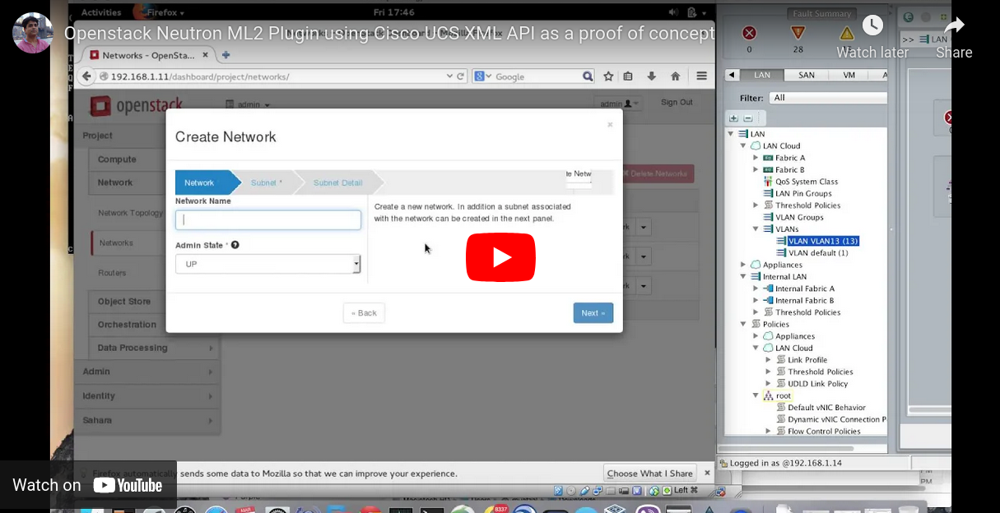

# OpenStack ML2 RINA driver implememtation

Information about the implementation in [this issue](https://github.com/OPEN-VERSO/netmap-rina-router/issues/158).

## Load a ML2 driver to OpenStack

1. Copy the driver file into `/opt/stack/neutron/neutron/plugins/ml2/drivers`

2. Update the `/etc/neutron/plugins/ml2/ml2_conf.ini` configuration file
    * In the `[ml2]` section of the file, configure mechanism_drivers, as follows:

    ```source
    [ml2]
    ... 
    mechanism_drivers = ovn,logger,cookbook
    ```

**Important:**
The `mechanism_drivers` field represents **ordered** list of networking mechanism driver entrypoints to be loaded from the neutron.ml2.mechanism_drivers namespace.

3. Open the `/opt/stack/neutron/neutron.egg-info/entry_points.txt`

4. In the [neutron.ml2.mechanism_drivers] section of the file, configure the Python class that needs to be loaded for the mechanism driver named `cookbook`.
  
  ```source
  [neutron.ml2.mechanism_drivers]
  ...
  cookbook = neutron.plugins.ml2.drivers.ch10_ml2_mech_driver:CookbookMechanismDriver
  ```

5. Restart the Neutron services in your DevStack setup.
  
  ```source
  python3 $(which neutron-server) --config-file /etc/neutron/neutron.conf --config-file /etc/neutron/plugins/ml2/ml2_conf.ini --log-file ./server.log
  ```

   * Here we are passing the neutron config default file, the modified `ml2/ml2_conf.ini` and we are keeping a log of all this info in server.log`

## Use the OpenStack CLI

Very likely you will get the following error when trying to use the openstack CLI:

```source
Missing value auth-url required for auth plugin password.
```

In order to use the OpenStack CLI, you need to have a set of environment variables set up. To do so, make sure you are logged into horizon and download the rc file (right corner). After that do:

```source
source admin-openrc.sh
```

Note that you have to download the rc file of the project you are working on

[(source)](https://stackoverflow.com/questions/42844649/missing-value-auth-url-required-for-auth-plugin-password)

## Processing API requests for a Network

### Create a Network 

There are two ways of creating a network: using the GUI or using the CLI.

#### Using the Horizon GUI

[Muhammad Afzal](https://community.cisco.com/t5/user/viewprofilepage/user-id/376120) (Cisco Employee) has [written a tutorial](https://community.cisco.com/t5/unified-computing-system-blogs/writing-your-own-openstack-neutron-ml2-driver-for-cisco-ucs/ba-p/4124753) on how to deploy a ML2 mech driver.

In this short video he shows a demo of his workign ML2 driver implementation and shows how to create a netwok using the GUI:

[](https://www.youtube.com/watch?v=k20XZZ4fQpw)

#### Using the Openstack CLI

First let's see the networks are already up in openstack:

```source
$ openstack network list

+--------------------------------------+---------+----------------------------------------------------------------------------+
| ID                                   | Name    | Subnets                                                                    |
+--------------------------------------+---------+----------------------------------------------------------------------------+
| 9273af61-890f-47b5-bc03-384d12b2089e | public  | 8646b776-2ac7-4ed5-b76c-7620b9225cbe, ef9e99f3-afd5-491f-bae9-efea1081cac2 |
| f9cb8ef8-d218-43f0-a3bc-0cddaaec0e35 | private | 80b5d45f-f53d-4649-af52-cd4af54d82ff, cfb4b9fb-5fe9-404f-bc85-d8677f559187 |
+--------------------------------------+---------+----------------------------------------------------------------------------+****
```
> In my case there are two existing networks: `public` and `private` (the NAT network an the host network, respectively).

Now let's create a network using the CLI:

```source
openstack network create Net1
```

That command should create a new network called `Net1`. Let's check it:

```source
$ openstack network list

+--------------------------------------+---------+----------------------------------------------------------------------------+
| ID                                   | Name    | Subnets                                                                    |
+--------------------------------------+---------+----------------------------------------------------------------------------+
| 9273af61-890f-47b5-bc03-384d12b2089e | public  | 8646b776-2ac7-4ed5-b76c-7620b9225cbe, ef9e99f3-afd5-491f-bae9-efea1081cac2 |
| aaf1aa8e-9cc4-4131-a27e-801b94299e37 | Net1    |                                                                            |
| f9cb8ef8-d218-43f0-a3bc-0cddaaec0e35 | private | 80b5d45f-f53d-4649-af52-cd4af54d82ff, cfb4b9fb-5fe9-404f-bc85-d8677f559187 |
+--------------------------------------+---------+----------------------------------------------------------------------------+
```

Let's check now that our ML2 has been called to create the network. In my case I have the `server.log` i the home folder.

```source
$ cat ~/server.log | grep neutron.plugins.ml2.drivers.my_mechanism

INFO neutron.plugins.ml2.drivers.my_mechanism [None req-6cb3d7ba-3cb2-482f-b4a9-7dbfd4055ebd None None] Hello, mydriver initialize
INFO neutron.plugins.ml2.drivers.my_mechanism [None req-9f6de529-c63a-4e29-8490-fd1e88df4579 demo admin] Hello, inside create_network_postcommit
INFO neutron.plugins.ml2.drivers.my_mechanism [None req-9f6de529-c63a-4e29-8490-fd1e88df4579 demo admin] **** Create Network PostCommit ****
INFO neutron.plugins.ml2.drivers.my_mechanism [None req-9f6de529-c63a-4e29-8490-fd1e88df4579 demo admin] Current Network Name: Net1
INFO neutron.plugins.ml2.drivers.my_mechanism [None req-9f6de529-c63a-4e29-8490-fd1e88df4579 demo admin] Current Network Type: geneve
INFO neutron.plugins.ml2.drivers.my_mechanism [None req-9f6de529-c63a-4e29-8490-fd1e88df4579 demo admin] **** Create Network PostCommit 
```

Looking at the logs it can be seen that Openstack called the `create_network_postcommit` method of the ML2 driver.

### Update a Network

The `update_network_postcommit` method will be called when the network is updated. Let's update the network `Net1`.  only know how to update the name from the GUI for now. To do so, go to `Network` tab and then click on the `Networks` tab. Then, on the right click _Create Network_ and change the network name.

Let's see again the `server.log` to make sure the network has been updated using the `update_network_postcommit` method:

```source
$ cat ~/server.log | grep neutron.plugins.ml2.drivers.my_mechanism

INFO neutron.plugins.ml2.drivers.my_mechanism [None req-f04490a4-4ca7-4a6e-8ca8-8d2fe6b0c0c6 demo admin] **** Update Network PostCommit ****
INFO neutron.plugins.ml2.drivers.my_mechanism [None req-f04490a4-4ca7-4a6e-8ca8-8d2fe6b0c0c6 demo admin] Current Network Name: Net1_updated
INFO neutron.plugins.ml2.drivers.my_mechanism [None req-f04490a4-4ca7-4a6e-8ca8-8d2fe6b0c0c6 demo admin] Previous Network Name: Net1
INFO neutron.plugins.ml2.drivers.my_mechanism [None req-f04490a4-4ca7-4a6e-8ca8-8d2fe6b0c0c6 demo admin] Current Network Type: geneve
INFO neutron.plugins.ml2.drivers.my_mechanism [None req-f04490a4-4ca7-4a6e-8ca8-8d2fe6b0c0c6 demo admin] **** Update Network PostCommit ****
```

## Code samples for OpenStack Networking Cookbook

[OpenStack Networking Cookbook](https://www.packtpub.com/virtualization-and-cloud/openstack-networking-cookbook)
Author(s): Sriram Subramanian and Chandan Dutta Chowdhury
Published by: Packt Publishing

**Files:**

1. `ch10_ml2_mech_driver.py` - the main ML2 mechanism driver file. We will use this file as the starting point and will be updating it for the recipes in Chapter 10.
  
2. `ch10_ml2_mech_driver_network.py` - this file contains Network related mechanism driver methods.

3. `ch10_ml2_mech_driver_subnet.py` - this file contains Subnet related mechanism driver methods.
  
4. `ch10_ml2_mech_driver_port.py` - this file contains Port related mechanism driver methods.

5. `ch10_ml2_mech_driver_final.py` - This file represents the final mechanism driver that includes Network, Subnet and Port driver methods.

6. `local.conf` - The conf file can be used in your DevStack setup
